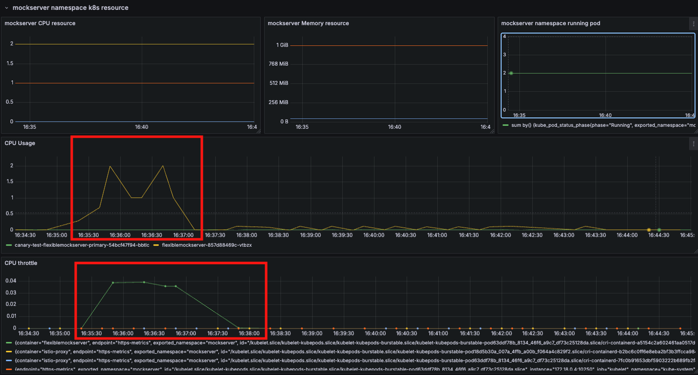
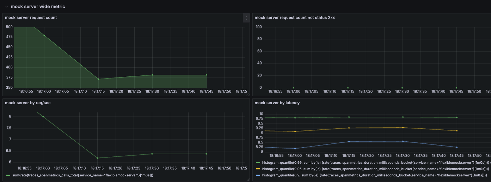
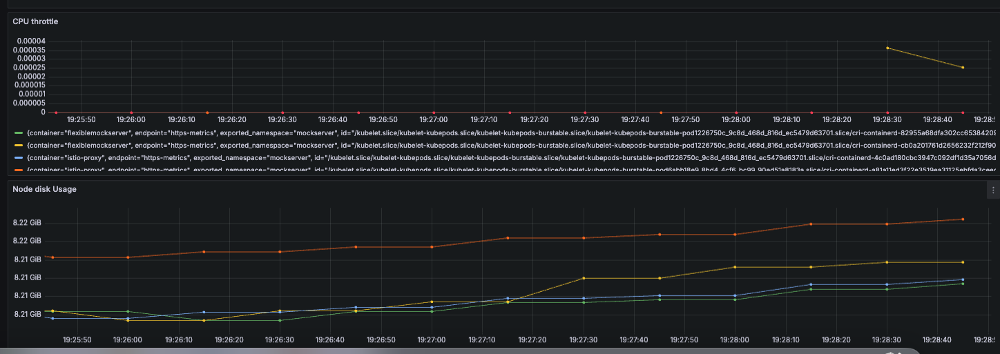

# Kubernetes resource(request/memory) Docs

## Kubernetesにおけるresource設計

### CPU

TBU

### Memory

TBU

### Storage

TBU

## ハンズオン

### podで設定しているCPU(resource.limit)を超えたらどうなるのか？

```
> kubectl apply -k sample_manifest/kubernetes/locust/sample2/
```

上記のコマンドを実行して一定タイミングを超えた段階でCPUに高負荷を与える処理を走らせてみました。

```
root@flexiblemockserver-857d88469c-vtbzx:/# curl http://localhost:8080/120/1/max-cpu
{"message":"1Core is used for 120.0 seconds MAX"}
```

その結果、以下のような結果になりました。


上記の画像をさらに深ぼってみると、


レイテンシーが悪化しているポイントがあるのが分かります。

ここから、実際podのCPUはどのような変化をしていたのかを深掘りしていきます。


上記の画像を深掘りしていくと、



CPU Usageが該当時間割り当てpodのmaxを超えていて、かつスロットリングが発生していることがわかります。

よって、ここから分かることはCPUがmaxに到達してもpodは死なないがスロットリングが発生してパフォーマンスが劣化することが分かりました。

> [!NOTE]
> ここまで検証してCPUスロットリングを理解した上で知っておきたいこと。
> * cpuが100%を超えてもpodは死なない。
>  * これは**CPUスロットリング**が発生するから
> * k8sの運用において、podのCPUが高負荷の状態でレイテンシーが悪化した時にCPU以外に変化がない場合はスロットリングを疑う必要がある。
>   * 基本的に恒常的にスロットリングが起きる状態は正常な状態とは言えないので、**resource調整が必要**
> * 通常のpod監視においてスロットリングの監視をしておくことは有用
>   * 今回示したように通常のCPUが増加傾向を示しただけでは原因がわからない。スロットリングのメトリクスと組み合わせて監視を行うことで初めて分かる。


### podで設定しているMemory(resource.limit)を超えたらどうなるのか？

podで設定しているCPU(resource.limit)がlimitを超えた時にはスロットリングが走ってアプリケーションに直接的な影響を与えることはなかったがmemoryがlimitを超えた時にどうなるかも記載する。

今回も負荷をかけながら一定のタイミングでmemoryがlimitを超える処理をかけてみる。

```
> kubectl apply -k sample_manifest/kubernetes/locust/sample2/
```

上記のコマンドを実行して一定タイミングを超えた段階でCPUに高負荷を与える処理を走らせてみました。

```
root@flexiblemockserver-857d88469c-vtbzx:/# curl http://localhost:8080/1000/max-memory
```

実際にメトリクスをみると、


負荷試験用のメトリクスでエラーが発生していることが分かる。



リクエスト量も減っている。


podの再起動も走っている。

ここから分かるのは、CPUはlimitを超えてもpod自体に直接的な影響は出ないがメモリーはlimitを超えると再起動が走る。
※今回memoryのメトリクスを表示していない理由は、Prometheusが巡回するタイミングでmax値が取れなかったため出していない。(逆に言うと、自前でk8sのメトリクスを取得する場合Prometheusの巡回タイミングも重要になる。)

> [!NOTE]
> ここまで検証してmemoryのlimitが超えた時の挙動を理解した上で知っておきたいこと。
> * cpuが100%を超えてもpodは死なないが、memoryは100%を超えるとpodは再起動する。
>   * したがって、memoryは余力を持った構成が必要

### podで設定しているstorage(resource.limit)を超えたらどうなるのか？

ここまで、CPU、Memoryとlimitが超えた時にどうなるのかについて挙動を追ってきましたが、ここからはstorageを追っていきたいと思います。

今回もある程度の負荷をかけながらその挙動を追っていきます。

```
> kubectl apply -k sample_manifest/kubernetes/locust/sample2/
```

上記のコマンドを実行して一定タイミングを超えた段階でstorageに高負荷を与える処理を走らせてみました。

```
root@flexiblemockserver-857d88469c-vtbzx:/# curl http://localhost:8080/1000/max-storage
```




今回もPrometheusの関係上storageレベルでは変化を体感することはできませんでしたが、podが再起動しました。

storageもlimitを超えるとpodが再起動することがわかりました。

> [!NOTE]
> * storageもmemoryと同様にlimitを超えるとpodは再起動します。
>  * storageにもlimitを設定する場合には、memory同様の設計をすることが重要です。
> * storageのlimitもしっかりと設定しましょう。
>   * storageのlimitを設定しないと、nodeのstorageを食い潰してしまうので、しっかりと設定しましょう。

**※ 私の環境では、storageの使用率をpodやcontainer、namespace単位で見ることができなかったのでNode単位で見ています。**
