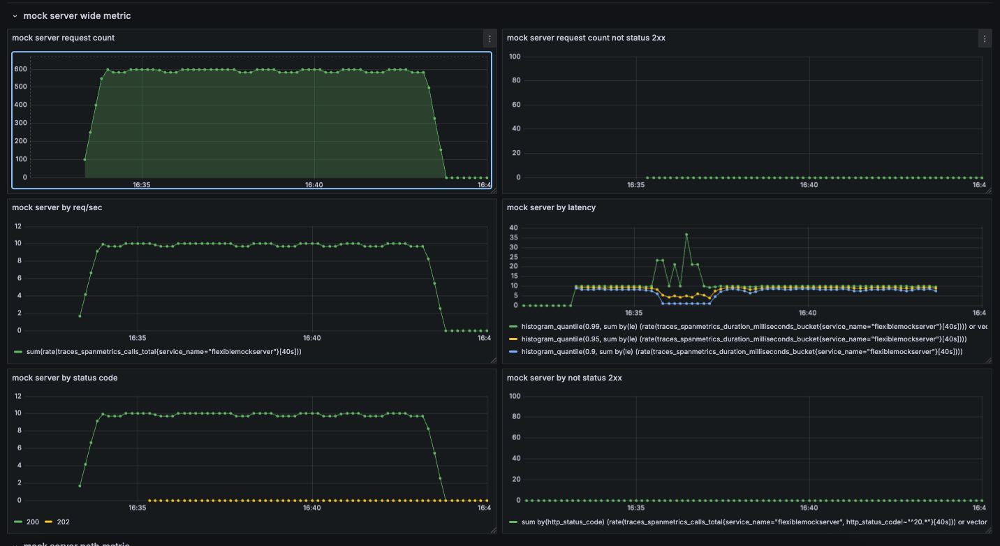
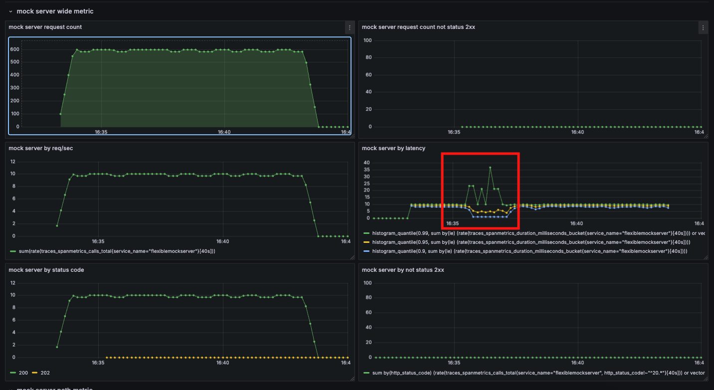
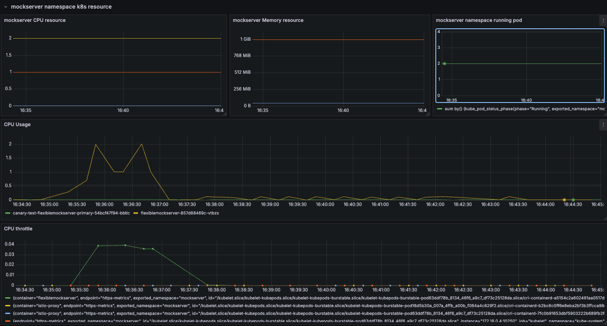

# Kubernetes resource(request/memory) Docs

## Kubernetesにおけるresource設計

### CPU

TBU

### Memory

TBU

## ハンズオン

### podで設定しているCPU(resource.limit)を超えたらどうなるのか？

```
> kubectl apply -k sample_manifest/kubernetes/locust/sample2/
```

上記のコマンドを実行して一定タイミングを超えた段階でCPUに高負荷を与える処理を走らせてみました。

```
root@flexiblemockserver-857d88469c-vtbzx:/# curl http://localhost:8080/120/1/max-cpu
{"message":"1Core is used for 120.0 seconds MAX"}
```

その結果、以下のような結果になりました。



上記の画像をさらに深ぼってみると、



レイテンシーが悪化しているポイントがあるのが分かります。

ここから、実際podのCPUはどのような変化をしていたのかを深掘りしていきます。



上記の画像を深掘りしていくと、


CPU Usageが該当時間割り当てpodのmaxを超えていて、かつスロットリングが発生していることがわかります。

よって、ここから分かることはCPUがmaxに到達してもpodは死なないがスロットリングが発生してパフォーマンスが劣化することが分かりました。

### podで設定しているMemory(resource.limit)を超えたらどうなるのか？

TBU
